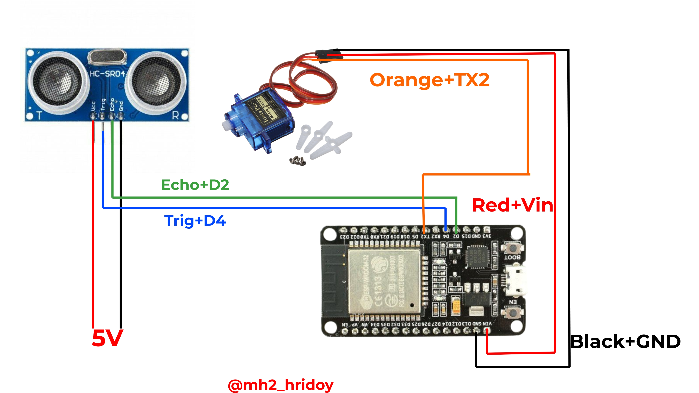

# 📡 ESP32 Radar System

A real-time **ESP32-based WiFi Radar System** using an **Ultrasonic Sensor (HC-SR04)** and a **Servo Motor**.  
This project creates a **radar-style web interface** that visually displays object distance and angle in real time.

---

## 🚀 Features

- 📶 ESP32 SoftAP (No external WiFi required)
- 🌀 Servo motor sweep (0° – 180°)
- 📏 Real-time distance measurement using ultrasonic sensor
- 🌐 Live radar animation using HTML Canvas
- 📡 Captive portal style access
- ⚡ Fast & lightweight web interface

---

## 🧰 Components Used

- ESP32 Development Board  
- Ultrasonic Sensor (HC-SR04)  
- Servo Motor (SG90 / MG90)  
- Jumper Wires  
- External 5V supply (recommended for servo)

---

## 🔌 Pin Configuration

| Component | ESP32 Pin |
|---------|-----------|
| TRIG    | GPIO 4    |
| ECHO    | GPIO 2    |
| SERVO   | GPIO 17   |

---

## 🖥️ How It Works

1. ESP32 creates a WiFi hotspot named **MH2_RADAR**
2. Servo motor rotates from 0° to 180°
3. Ultrasonic sensor measures distance at each angle
4. ESP32 sends angle & distance data to the web page
5. HTML Canvas renders a real-time radar animation

---

## 🌐 How to Use

1. Upload the code to ESP32
2. Power the ESP32
3. Connect your phone or PC to WiFi:  
   **SSID:** `MH2_RADAR`
4. Open any browser  
5. Radar UI will open automatically 🎯

---

## 📂 File Structure
